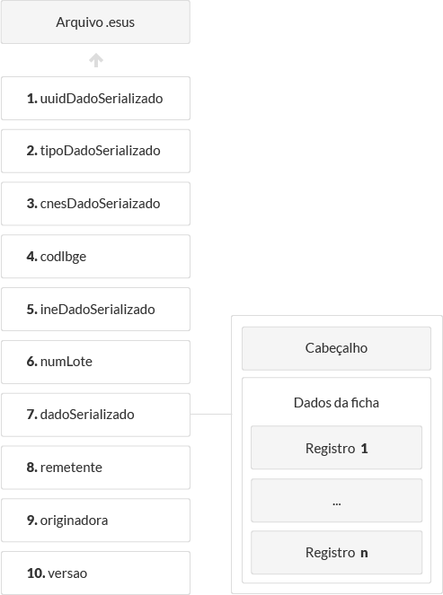

#### Lote

Um lote é um conjunto de arquivos de dados.

####Arquivo de dados

Cada arquivo de dados representa uma ficha.

Os arquivos de dados possuem a mesma macro estrutura, referenciada como camada de transporte. A camada de transporte do arquivo de dados independe do tipo da ficha.

Quando a integração é realizada através do **Apache Thrift** os arquivos de dados devem ser compactados com extensão ".esus". Cada arquivo representa um dadoTransport serializado através do [TBinaryProtocol](https://github.com/apache/thrift/blob/0.9.2/lib/java/src/org/apache/thrift/protocol/TBinaryProtocol.java).

A estrutura da Camada de Transporte é ilustrada na imagem abaixo:

 *Camada de transporte - Macro estrutura de um arquivo de dados*

A definição de cada um dos elementos da Camada de transporte é apresentada no documento .

O dado serializado possui dois componentes: Cabeçalho e Dados da ficha.

- O dicionário de dados do **Cabeçalho** é definido no documento ;

- Os **Dados da ficha** devem ser estruturados em registros Thrift/XML conforme descrito no documento .